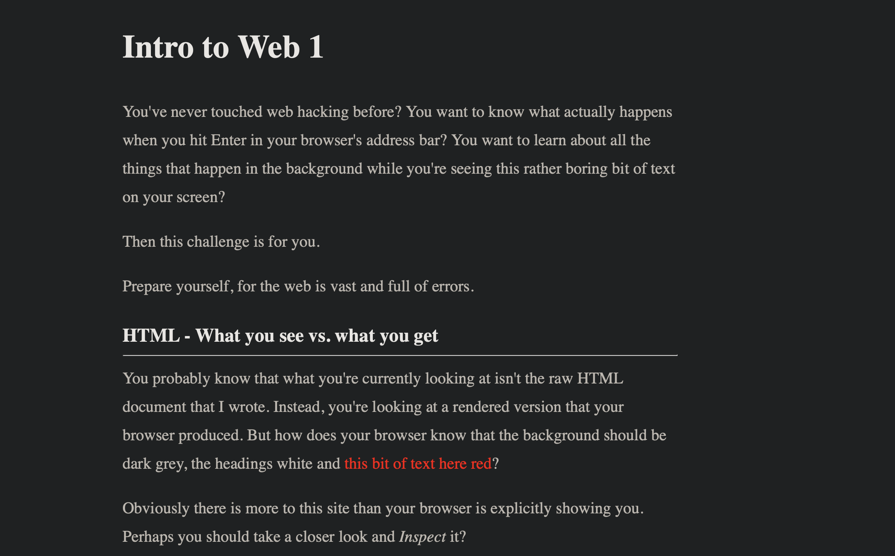

# Intro Web 1

## Challenge

You've never touched web hacking before? You want to know what actually happens when you hit Enter in your browser's address bar? You want to learn about all the things that happen in the background while you're seeing this rather boring bit of text on your screen?

Then this challenge is for you.

Prepare yourself, for the web is vast and full of errors.

- This is an intro challenge, and is trying to teach the basics of web security to beginnners.
- A snippet of the website looks like this:

## Approach

1. Being an intro challenge, the steps to obtain the flag are heavily guided, and the first part of the flag can be retrieved from just inspecting the source code of the web page.

2. For the second part of the flag, we know that there is a `countDownTime` variable that is set to > 9000 seconds before we can get that. Instead of waiting, we just use the browser console and run `countDownTime = 0` so that we can get the second part immediately.

3. For the last part, we just need to inspect the network requests tab and we can find the last part of the flag as a header attached to the response of the web page.

## Flag

CSCG{access_granted_e7e768b0_to_the_next_level}
