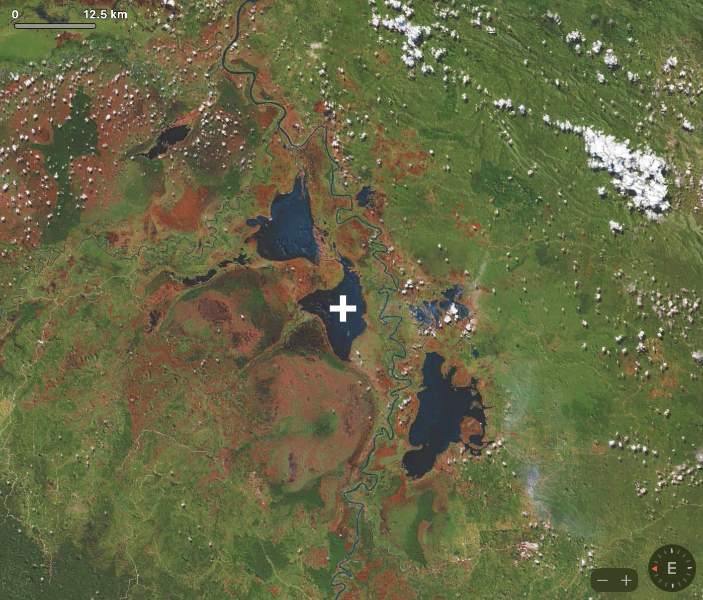
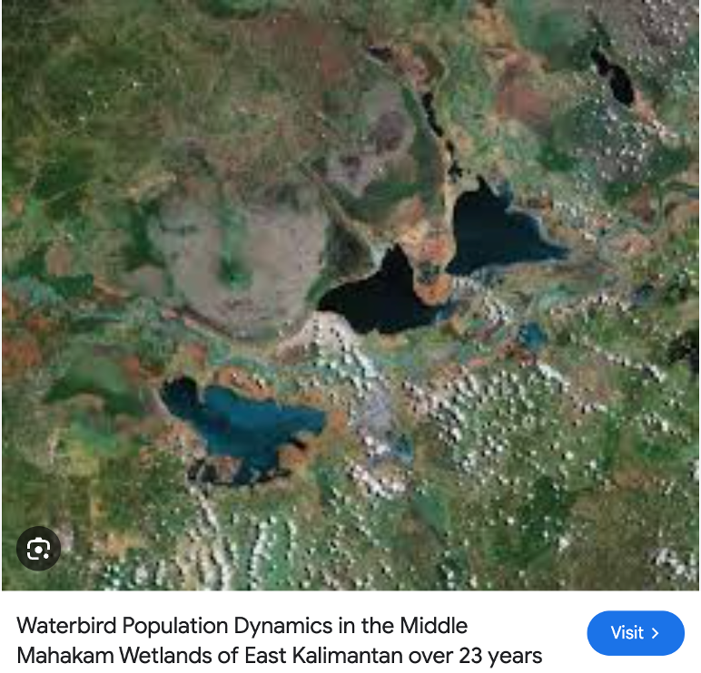
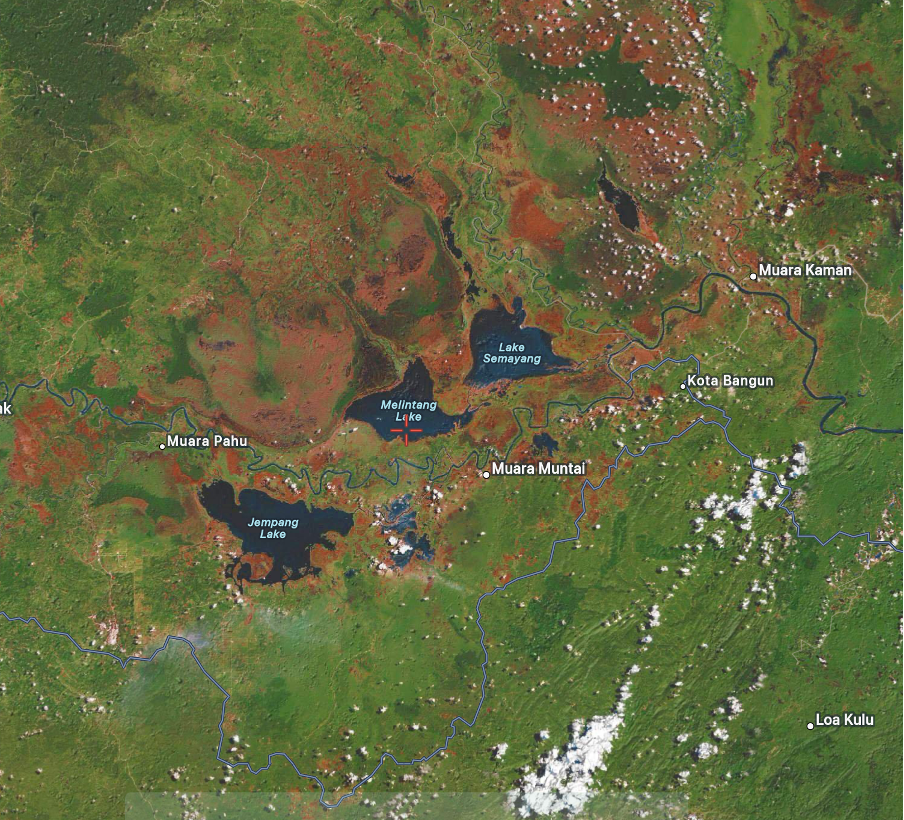

# Level 1: Target Reference Point (OSINT)

## Challenge

One of our U2 spy planes spotted Spectre units around the area surrounding these lakes. However we lost location metadata while collecting huge amounts of imagery. Can you help us find the name of the lake marked by the target reference point ‘+’ symbol? https://satellites.pro/ might be useful to compare a variety of imagery sources.

## Approach

1. Doing a google images reverse search, we can look for images that match the notable features of the given image, which to me were the reddish hills on one side of the lake as well as the whitish areas spread around the lakes. The 3 lakes in such close proximity were also a telling feature. After some searching, the following image can be found:

2. Since the photo is captioned as East Kalimantan, we just look for that region in the website given by the challenge: https://satellites.pro/ and it can be seen that the given image seems to be a rotated screenshot of that region, which looks like this on the site:

3. Therefore, the middle lake is the one needed. 

## Flag

tisc{lake_melintang}