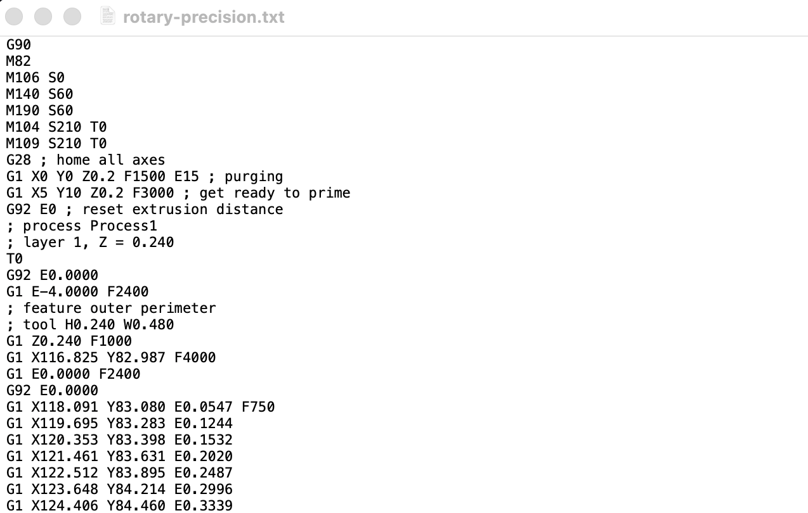
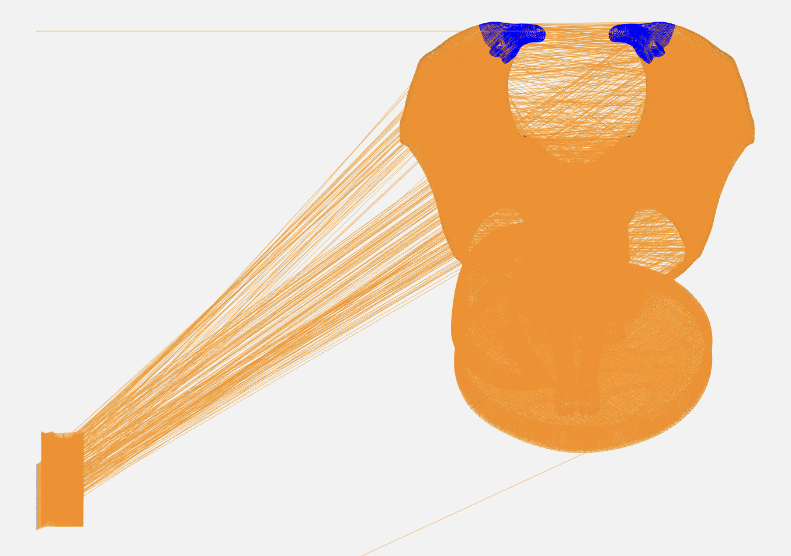
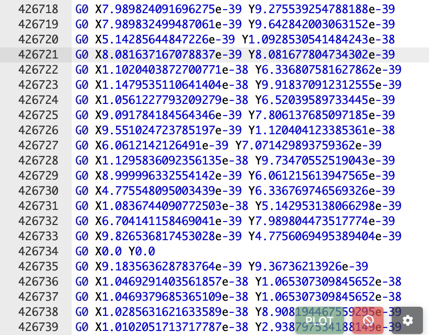

# Level 3: Rotary Precision

## Challenge

We’ve recovered a file from an SD card. It seems important, can you find the hidden content?

The challenge also gives a file named rotary-precision.txt, which looked like this:



## Approach

1. I had never seen this type of code before, but searching about it quickly reveals that it is G Code, which can be rendered online. Using an online renderer gives the following image:



2. The gargoyle image had blue coloured parts, but that quickly turned out to be a red herring. And from other G Code challenges, the flag is sometimes found by rotating the image around and revealing the flag spelled out somewhere in the image. But that doesn't work here.

3. If we instead try to focus on the part of the image away from the main gargoyle, we see that the points have values like this:



4. After extracting out all the lines with these extremely small X and Y values into an output.txt file, I ran the following script:

```
import struct

bytes = []

with open("output.txt") as f:
    for line in f:
        x_str, y_str = line.split()
        x = float(x_str)
        y = float(y_str)

        bytes.append(struct.pack('f', x))
        bytes.append(struct.pack('f', y))

output = ""

for byte in bytes:
    cleaned = byte.replace(b"\x00", b"")

    try:
        output += cleaned.decode("ascii", errors="ignore")
    except UnicodeDecodeError:
        pass

print(output)
```

5. Running the above script gives the following output: 

```
aWnegWRi18LwQXnXgxqEF}blhs6G2cVU_hOz3BEM2{fjTb4BI4VEovv8kISWcks4
def rot_rot(plain, key):
        charset = "ABCDEFGHIJKLMNOPQRSTUVWXYZabcdefghijklmnopqrstuvwxyz0123456789{}_"
        shift = key
        cipher = ""
        for char in plain:
                index = charset.index(char)
                cipher += (charset[(index + shift) % len(charset)])
                shift = (shift + key) % len(charset)

        return cipher
```

6. Now, we can brute force the shift to find the flag as such:

```
plain = "aWnegWRi18LwQXnXgxqEF}blhs6G2cVU_hOz3BEM2{fjTb4BI4VEovv8kISWcks4"
for i in range(len("ABCDEFGHIJKLMNOPQRSTUVWXYZabcdefghijklmnopqrstuvwxyz0123456789{}_")):
        res = rot_rot(plain, i)
        if "TISC" in res:
                print(res)
```

## Flag

TISC{thr33_d33_pr1n71n9_15_FuN_4c3d74845bc30de033f2e7706b585456}
