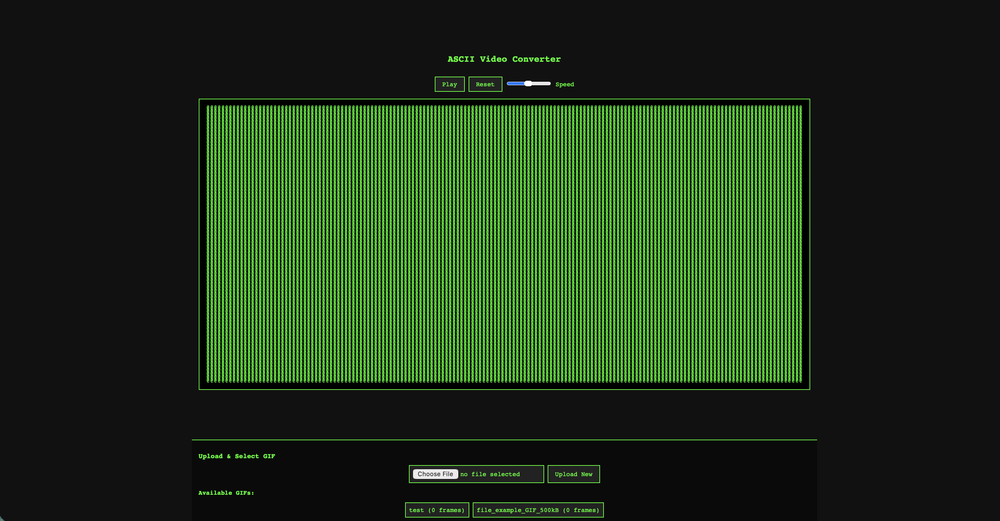
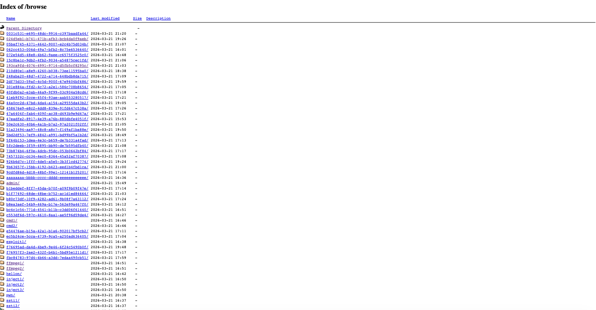
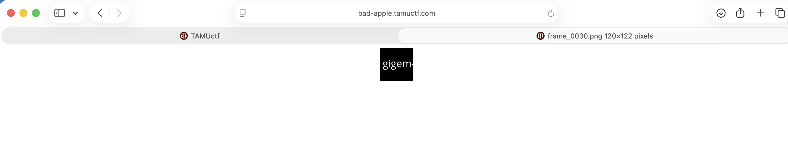

# bad-apple

## Challenge

funny touhou reference

https://bad-apple.tamuctf.com

We are also given the source code of the web app in the folder: `bad-apple`.

The homepage of the web app looks like this:



## Approach

1. First, inspecting the source code, a notable point is in the config file:

```
Alias /browse /srv/http/uploads
    <Directory /srv/http/uploads>
        Options +Indexes
        DirectoryIndex disabled
        IndexOptions FancyIndexing FoldersFirst NameWidth=* DescriptionWidth=* ShowForbidden
        AllowOverride None
        Require all granted

        <FilesMatch "\.gif$">
            AuthType Basic
            AuthName "Admin Area"
            AuthUserFile /srv/http/.htpasswd
            Require valid-user
        </FilesMatch>
    </Directory>
```

We see that there is a /browse endpoint to access.

2. Going directly to the /browse endpoint, we can see all the uploads by users as such:



3. We can see that there is an admin folder, and accessing that, we see that there is a gif file `e017b6321bda6812ec80e9fac368709e-flag.gif`. However, trying to access it directly is of course a long shot, and indeed it is password protected.

4. Going back to the source code now, we see that there are two endpoints **/convert** and **/get_frames** that don't properly authenticate users as follows:

```
@app.route('/convert')
def convert():
    user_id = request.args.get('user_id', 'anonymous')
    filename = request.args.get('filename', '')

    input_path = os.path.join(app.config['UPLOAD_FOLDER'], secure_filename(user_id), filename)
    if not os.path.exists(input_path):
        return "File not found", 404

    safe_name = os.path.splitext(os.path.basename(filename))[0]
    output_dir = os.path.join(FRAMES_BASE, user_id, safe_name)
    os.makedirs(output_dir, exist_ok=True)

    try:
        frame_count = extract_frames(input_path, output_dir, safe_name)
        return redirect(url_for('index', view=safe_name, user_id=user_id))
    except Exception as e:
        return f"Error processing file: {str(e)}", 500

@app.route('/get_frames')
def get_frames():
    user_id = request.args.get('user_id', 'anonymous')
    gif_name = request.args.get('gif_name', '')

    frames_dir = os.path.join(FRAMES_BASE, user_id, gif_name)

    if not os.path.exists(frames_dir):
        return jsonify({'error': 'GIF not found'}), 404

    frames = sorted([f for f in os.listdir(frames_dir) if f.startswith('frame_') and f.endswith('.png')])

    return jsonify(frames)
```

5. I thought that these might have some form of path traversal vulnerability, and tried various payloads like `../../../srv/http/.htpasswd` to try and retrieve the password file, but these didn't work. But `get_frames` does show us that the admin's flag gif's frames are accessible and it shows us the exact number of frames.

6. Hence, the part to focus on is actually where the frames are stored. In the app code, we see that frames are stored at `/srv/http/static/frames`, and for each gif, the location is as such: `/srv/http/static/frames/<user>/<gif>`.

7. Hence, we just access this in the browser, using `admin` as the username and the admin's uploaded gif name as the final part of the path as such: `https://bad-apple.tamuctf.com/static/frames/admin/e017b6321bda6812ec80e9fac368709e-flag/frame_0001.png`.

8. Now, by going through the frames by changing the frame number, we can reconstruct the flag!



## Flag

gigem{3z_t0h0u_fl4g_r1t3}
