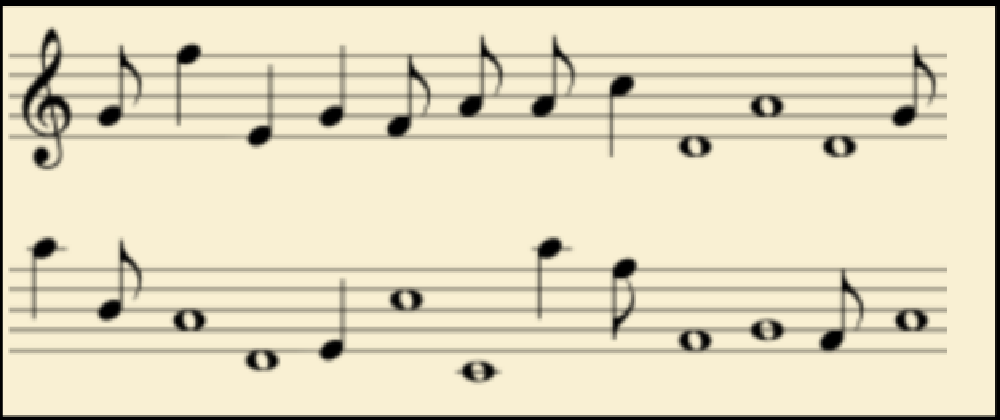
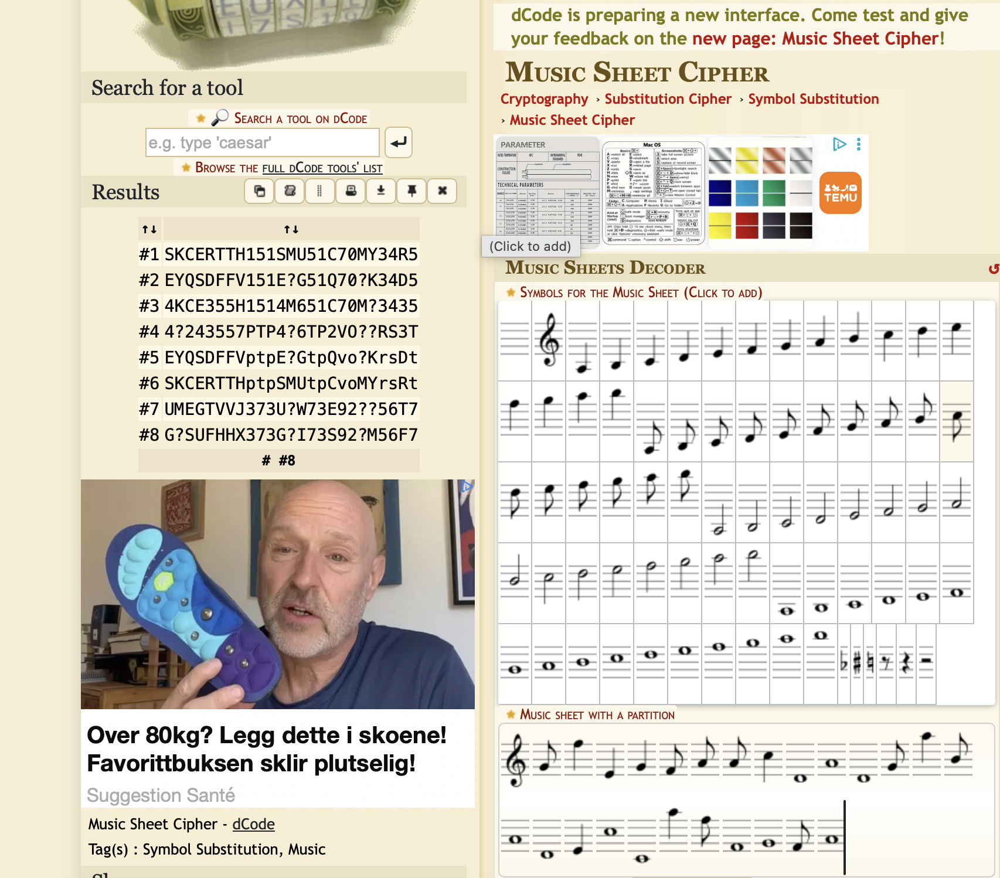

# Beethoven's Encryption (Crypto)

## Challenge

Wait there is some musician inside this corporation ?. Flag may be in non-standard format.

We are also given a file `beethoven.zip`.

## Approach

1. Trying to unzip the file doesn't work as the file is not actually a zip file. We can discover that it is actually a PNG file by running `file beethoven.zip`.

2.Now, I tried running `exiftool` and `strings` to check for any useful information, but that yielded nothing. Instead, I renamed the file to `beethoven.png` and now the file could be opened:

3. As someone who hadn't studied music, I tried decoding it using the musical notations and trying to figure out if each note corresponded to some letter between A-G as musical notes usually did. However, that quickly failed.

4. Instead, I did a quick search for a musical cipher decoder and found this: `https://www.dcode.fr/music-sheet-cipher`

5. After entering the musical notes in the image, we can obtain the flag:

## Flag

SKCERTTH151SMU51C70MY34R5
