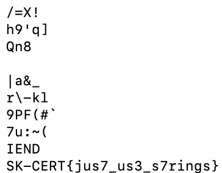

# Elephant 1 (Forensics)

## Challenge

Here is a picture of an elephant. He is huge, so the flag is probably somewhere behind him.

We are given the file `elephant.png`.

## Approach

1. Run `strings elephant.png`, and the flag is readily available as below:

## Flag

SK-CERT{jus7_us3_s7rings}
