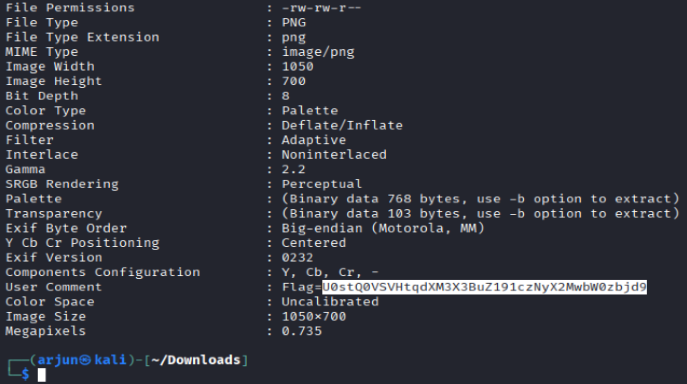

# Elephant 2 (Forensics)

## Challenge

This time, I tried to hide the flag much better. You should try to check the content of the image.

Once again, we are given a file `elephant.png` to find the embedded flag.

## Approach

1. Since it would be different from `Elephant 1`, I ran `exiftool elephant.png` on this file, and obtained the following:

2. The flag seems to be encoded in base64, so decoding it allows us to obtain the original flag.

## Flag

SK-CERT{jus7_png_us3r_c0mm3n7}
