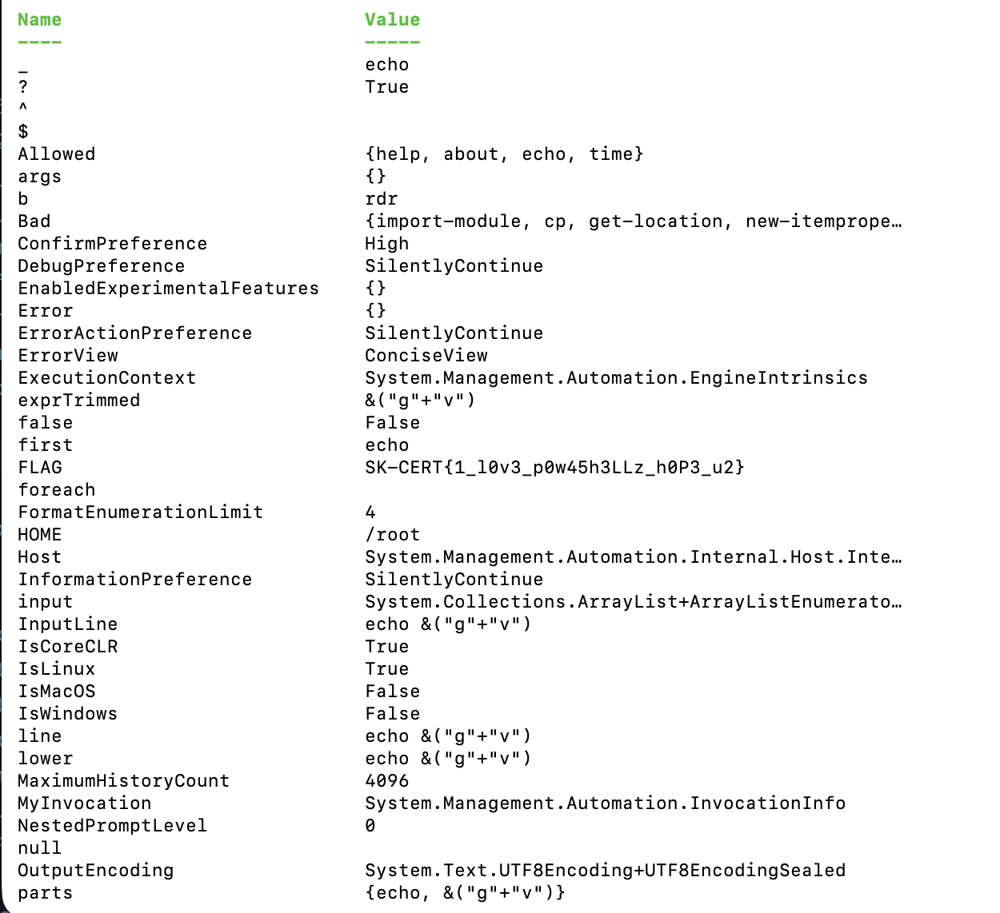

# JailPS - safeps

## Challenge

Get flag. Or git gud.

nc exp.cybergame.sk 7004

We are given the following [script](./jailps1.ps1) as part of the challenge folder as well.

## Approach

1.Reading through the script, we can see that there are input sanitization checks that prevent us from using direct approaches like `cat` to get the flag.

2. The first part of the payload needs to be `echo` as it is the only allowed first command that enables the script to continue instead of returning.

3. For the next part, we cannot use any of the blacklisted characters, which includes `_, $, =` etc.

4. The input also cannot be literal and cannot be alphanumeric, otherwise it will be blacklisted as well.

5. To retrieve the flag, we hence use this payload: `echo &("g"+"v")`, since the strings get evaluated to gv and the `&` operator allows us to run that command to retrieve the variables as such:

## Flag

SK-CERT{1_l0v3_p0w45h3LLz_h0P3_u2}
