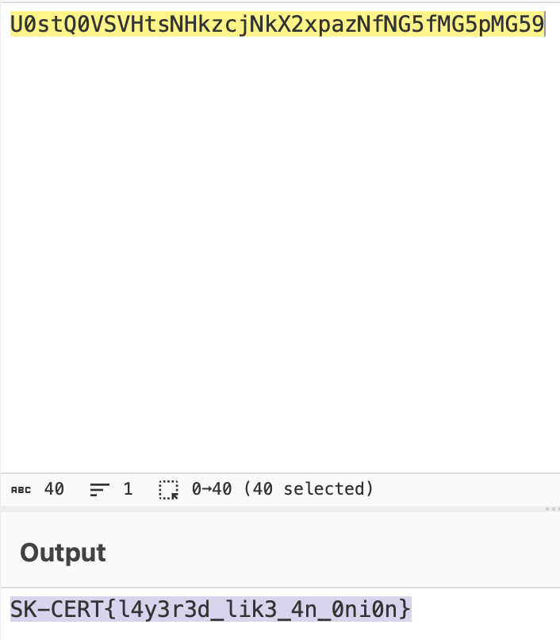

# Layers of Encoding

## Challenge

53 53 32 51 48 32 55 51 32 55 52 32 53 49 32 51 48 32 53 54 32 53 51 32 53 54 32 52 56 32 55 52 32 55 51 32 52 101 32 52 56 32 54 98 32 55 97 32 54 51 32 54 97 32 52 101 32 54 98 32 53 56 32 51 50 32 55 56 32 55 48 32 54 49 32 55 97 32 52 101 32 54 54 32 52 101 32 52 55 32 51 53 32 54 54 32 52 100 32 52 55 32 51 53 32 55 48 32 52 100 32 52 55 32 51 53 32 51 57

## Appoach

1. The string of values seems to be ASCII values, so I wrote this [script](./layers-script.py) to help decode the ascii values into a string.

2. The output of that script is `55 30 73 74 51 30 56 53 56 48 74 73 4e 48 6b 7a 63 6a 4e 6b 58 32 78 70 61 7a 4e 66 4e 47 35 66 4d 47 35 70 4d 47 35 39`, which can be deduced as hex characters.

3. Decoding that hex string, we now get `U0stQ0VSVHtsNHkzcjNkX2xpazNfNG5fMG5pMG59`, which can be deduced as a base64 string.

4. Doing the final base64 decoding, we get the flag as follows:

## Flag

SK-CERT{l4y3r3d_lik3_4n_0ni0n}
