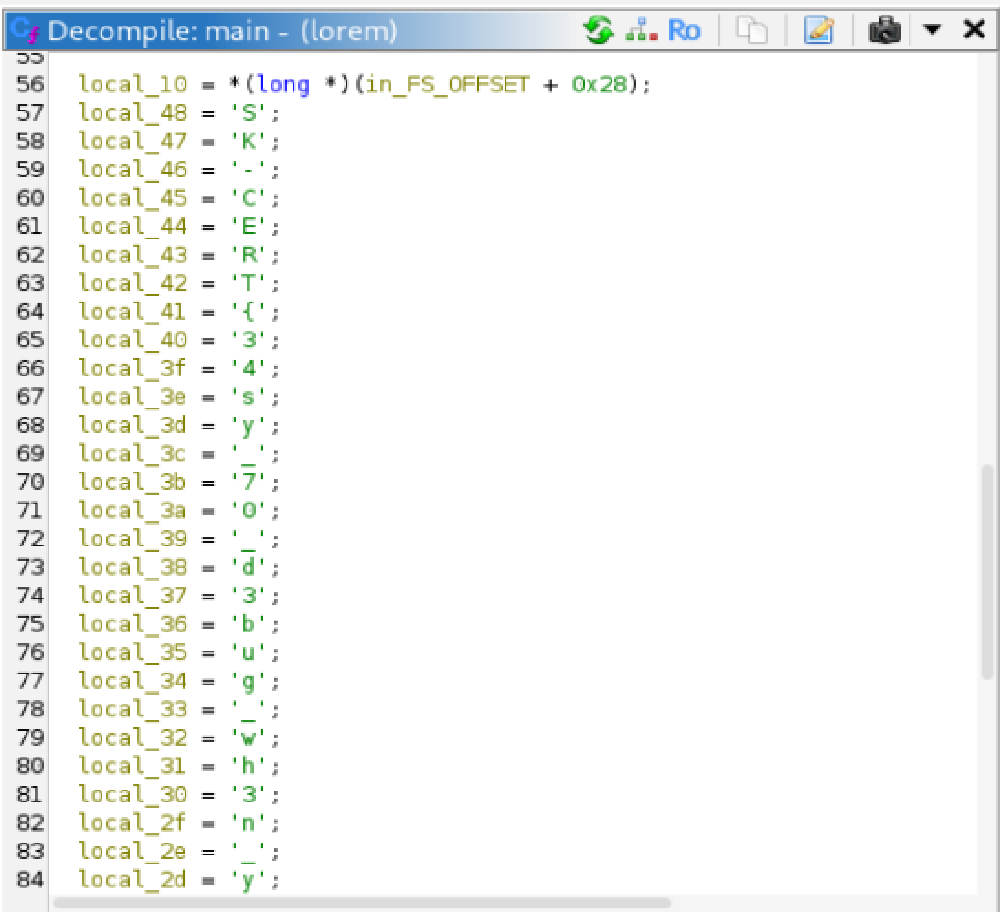

# Picking Letters (Reversing)

## Challenge

## Approach
1. Running `file lorem` confirms that it is a binary file, so I loaded the file into Ghidra to analyse it.

2. After the initial analysis by Ghidra, we can see the flag letter by letter in the decompiler window:

## Flag
SK-CERT{34sy_70_d3bug_wh3n_y0u_h4v3_wh0l3_c0d3}