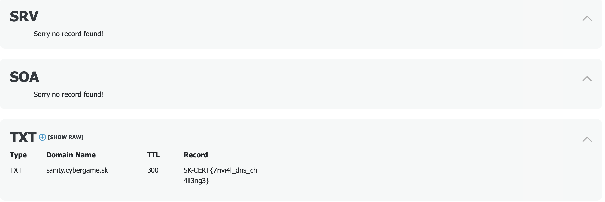

## Plain TXT (OSINT)

## Challenge

Check out DNS records for sanity.cybergame.sk.

## Approach

1. As the challenge dictates, we just look up DNS records for the site. I used the following website: `https://dnschecker.org`

2. I obtained the flag by manually scanning the records:

## Flag

SK-CERT{7rivi4l_dns_ch4ll3ng3}
