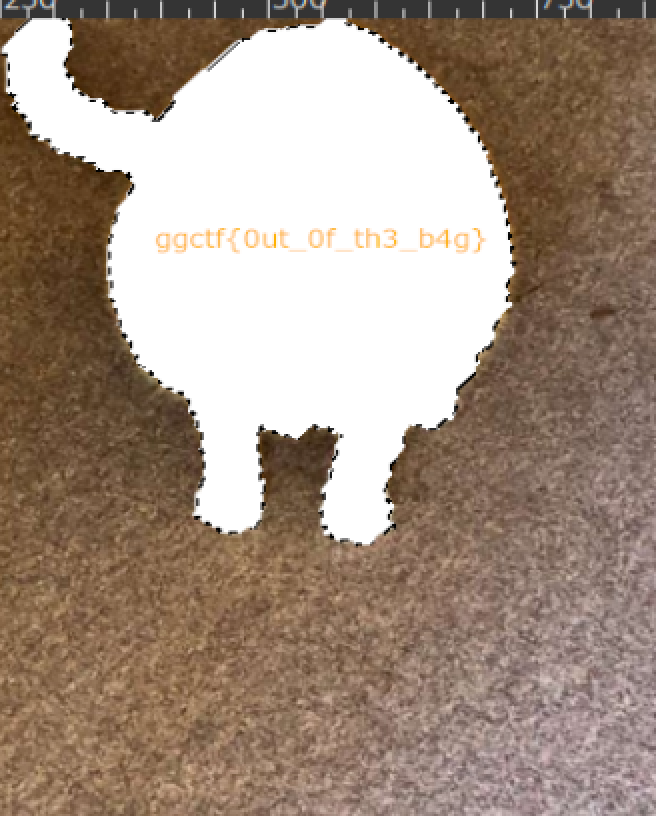

# cat Issues (Forensics)

## Challenge

I was working on making this challenge but this cat got in my way. BRO MOVE

We are also given two files: `huge_cat_project.png` and `huge_cat_project.xcf`.

## Approach

1. I had no experience with a xcf file extension before this, so a quick google search shows that it can be opened with GIMP.

2. After opening the xcf file, we see there are 2 layers to the image, so I removed the upper layer which was the image of the cat, and we can see the flag as follows:

## Flag

ggctf{0ut_0f_th3_b4g}
