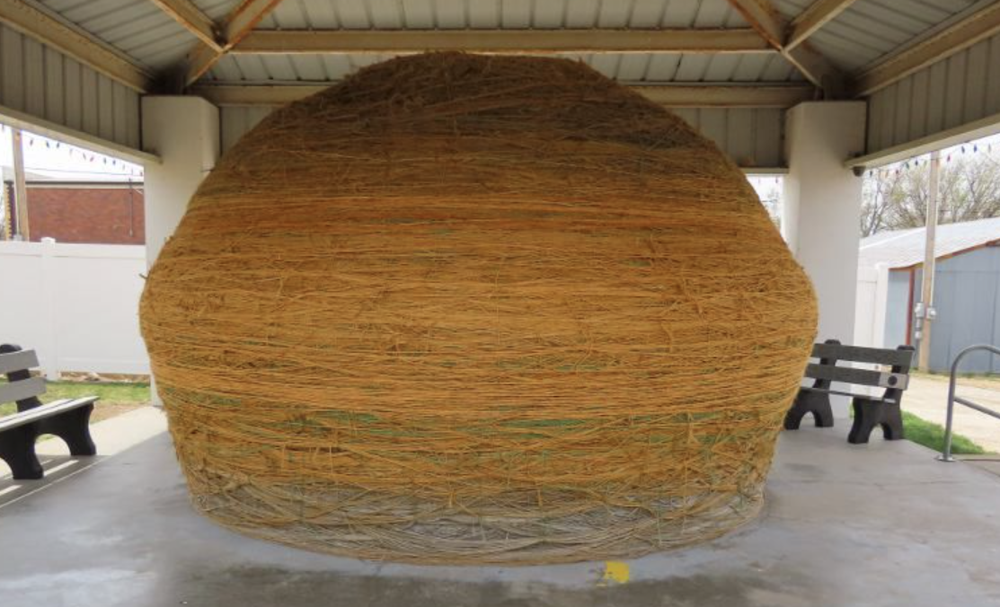

# Community Project (OSINT)

## Challenge

We pulled this photo from a suspect's device. Apparently the original creator of this ... thing was somewhat of a interest to our team. Identify who started the landmark pictured and submit their name.

FLAG FORMAT (case insensitive): ggctf{Firstname_Lastname}

We are given the image `01.png`:

## Approach

1. As with most OSINT challenges, I just used a Google Reverse Image search with the given image to see if there are any useful links.

2. There are many matching images with useful links, and following one of them gives us the name of the person responsible for the object in the image, giving us the flag!

## Flag

ggctf{Frank_Stoeber}
