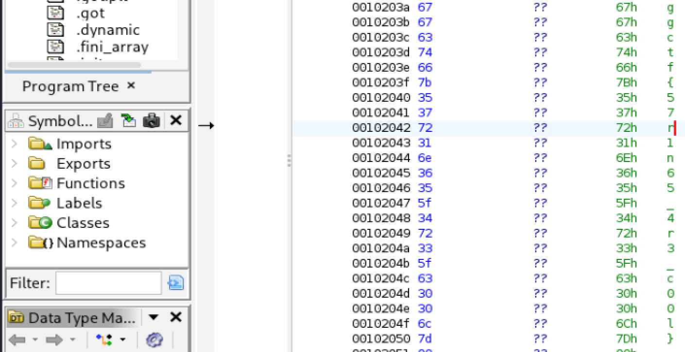

# Elden String (Reverse Engineering)

## Challenge

Legend tells of a secret phrase that will open this very poorly made password checker.

We are also given a binary file called `checker`.

## Approach

1. Using ghidra, we can open the file and inspect its contents.

2. After some manual scanning, we can see the following and retrieve our flag:

## Flag

ggctf{57r1n65_4r3_c00l}
