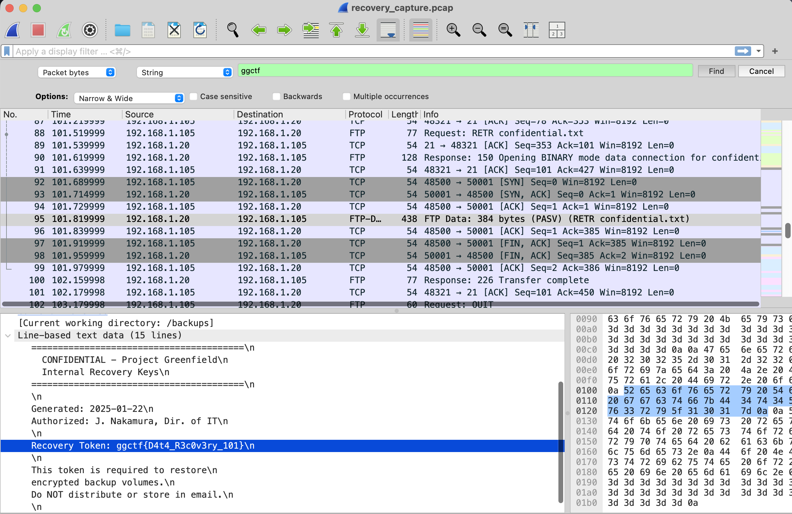

# Feet Toe Protocol (Data Analysis)

## Challenge
Find the flag in with the captured traffic. 

We are given a pcap file `recovery_capture.pcap` as well.

## Approach
1. Loading the pcap file into Wireshark, we just need to search for ggctf and we can obtain the flag as follows:

## Flag
ggctf{D4t4_R3c0v3ry_101}