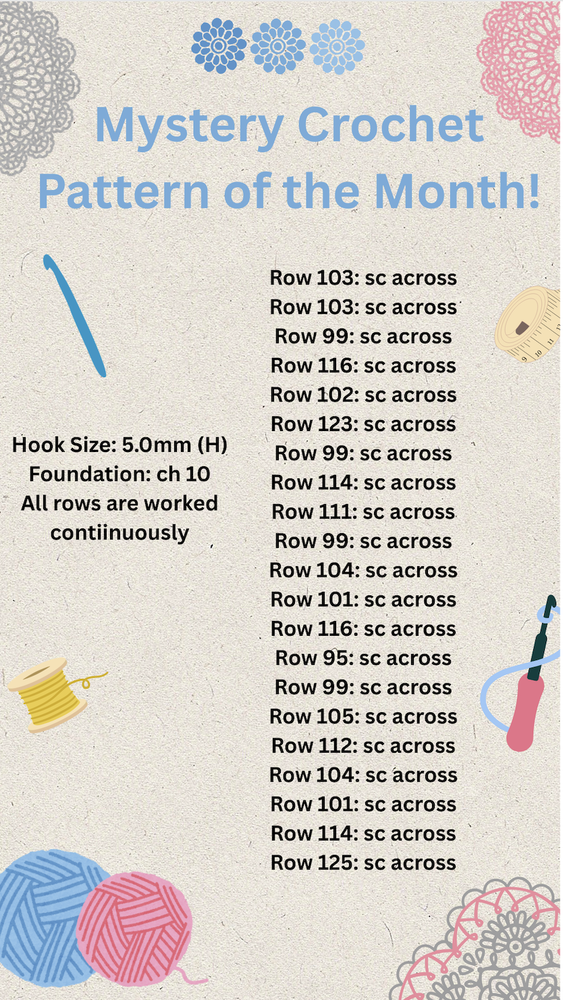

# Hooked on Crypto (Crypto)

## Challenge

Help! I subscribe to the Monthly Mystery Crochet Pattern and my pattern looks more mysterious than normal!

We are given the file crochet.png, which looks like this:

## Approach

1. The row numbers seemed like ASCII values, and we can see that is indeed the case from the first two values corresponding to the character `g`, and the last one being `}`.

2. Hence, I made this [script](./hooked_script.py) to make it easier to decode the ASCII values, and we can obtain the flag by running the script.

## Flag

ggctf{crochet_cipher}
