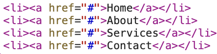
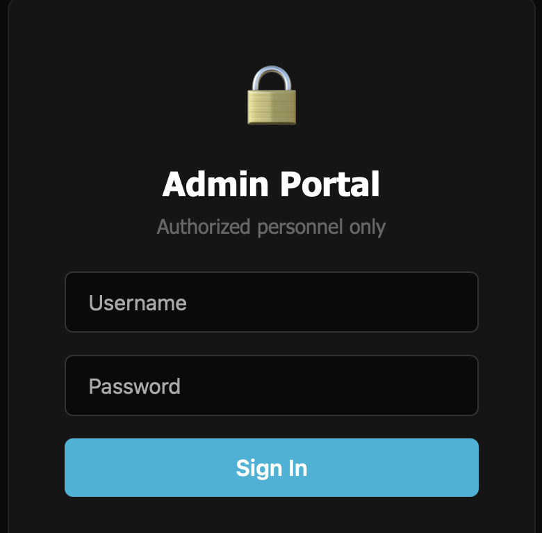

# No Crumbs (Web)

## Challenge

Big Bank Company Incorporated just launched their new website. They claim their security is rock solid, but maybe they left some crumbs behind. Can you find a way in?

https://ung-no-crumbs-web.chals.io/

## Approach

1. Upon visiting the site, I inspected the source code as usual to look for any hints, but there wasn't much useful information. The only interesting thing was that all the navigation links led back to the homepage, as seen below:

2. This made me think about exploring potential hidden routes in the app, and so I explored the robots.txt file to look for hints. There, we actually find that the route `/s3cr3t_p4nel/` is disallowed.

3. Now, visiting the route, we see that there is an admin portal login page as below:

4. When we inspect the network requests, we can see that there is an `admin` cookie attached to the login request with the value set to `false`, and so we are denied any access. Now, we just set this cookie value to `true`, and we can retrieve the flag!

## Flag

ggctf{r0b0t5_l0v3_c00k13s_t00}
