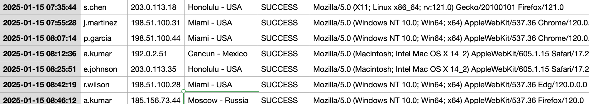

# Resort (Data Analysis)

## Challenge

You have been provided resort_logins.csv — a full week of authentication logs from the Paradise Palms employee portal.

Analyze the login data and identify the suspicious login that indicates a compromised account.

Flag will be formatted - ggctf{username_city_YYYY-MM-DD} Example - ggctf{b.beth_Miami_2025-01-14} "

## Approach

1. We open the csv file, and see that there are not that many rows, hence we can visually scan the logs to explore anomalies.

2. After some manual scanning, we can see that most logins are from USA, Mexico or Bahamas, but there is a singular login from Moscow, Russia.

3. The flag is obtained using that anomalous login attempt.

## Flag

ggctf{a.kumar_moscow_2025-01-15}
