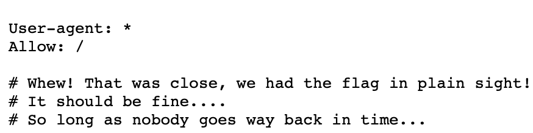
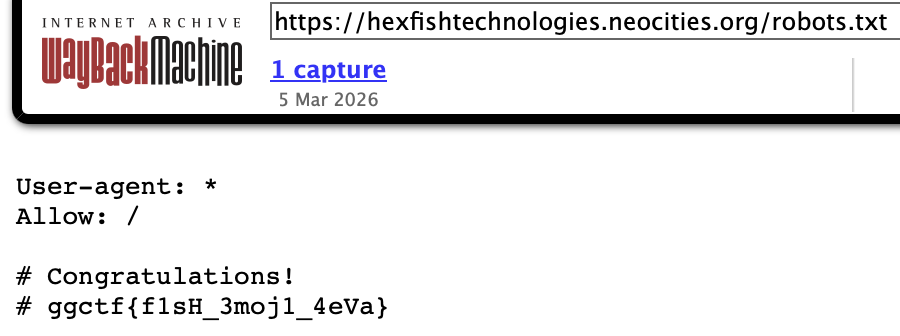

# Terminator (OSINT)

## Challenge

It appears that HexFish Technologies updated their neocities website recently. What were they trying to hide?

## Approach

1. First, we can visit neocities and search for `hexfish` under tags and find the mentioned neocities site.

2. Inspecting the webpage and trying to get clues gets us nowhere, so I tried the robots.txt route to see if there was any useful information. We get the following hint:

3. Now, we know that we need to find a previous version of the website. Using `https://web.archive.org`, we can search for the site URL and explore any archived versions of the site. There is only one, where we can retrieve the flag as follows:

## Flag

ggctf{f1sH_3moj1_4eVa}
