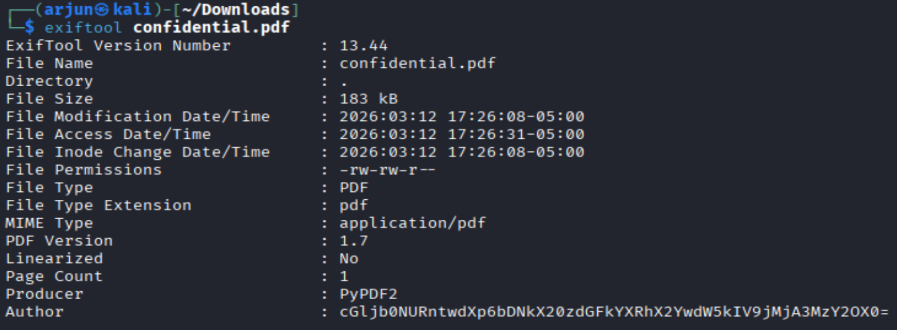

# Riddle Registry

## Challenge
Hi, intrepid investigator! 📄🔍 You've stumbled upon a peculiar PDF filled with what seems like nothing more than garbled nonsense. But beware! Not everything is as it appears. Amidst the chaos lies a hidden treasure—an elusive flag waiting to be uncovered.
Find the PDF file here Hidden Confidential Document and uncover the flag within the metadata.

## Approach
1. First, we inspect the file to see if there is any useful information, but there is only a hint saying that the secret is not in the text of the PDF file. 

2. The command `exiftool confidential.pdf` allows us to retrieve additional metadata about the given PDF file as such:

3. We can see that the author of the file looks like a base64 string, and decoding it gives us the flag!

## Flag
picoCTF{puzzl3d_m3tadata_f0und!_c2073669}