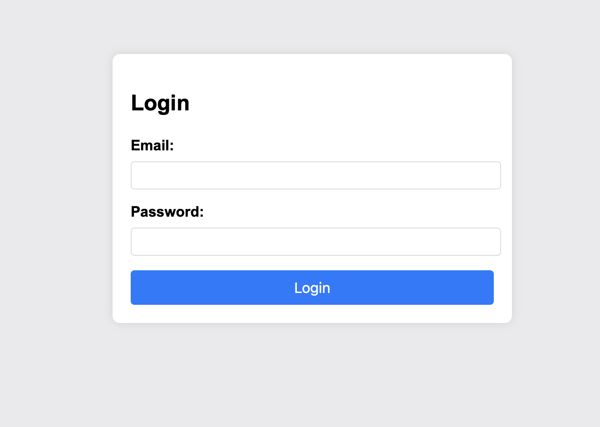

# Crack The Gate 1

## Challenge

We’re in the middle of an investigation. One of our persons of interest, ctf player, is believed to be hiding sensitive data inside a restricted web portal. We’ve uncovered the email address he uses to log in: ctf-player@picoctf.org. Unfortunately, we don’t know the password, and the usual guessing techniques haven’t worked. But something feels off... it’s almost like the developer left a secret way in. Can you figure it out?

Here is a snippet of the launched webpage:



## Approach

1. As with most web challenges, we inspect the source code to check for any initial clues. As expected, we see the following HTML comment:

```
<!-- ABGR: Wnpx - grzcbenel olcnff: hfr urnqre "K-Qri-Npprff: lrf" -->
<!-- Remove before pushing to production! -->
```

2. The first line looks like a simple caesar cipher, and using a shift of 13, we can decode it as: `NOTE: Jack - temporary bypass: use header "X-Dev-Access: yes`.

3. Therefore, we send a request to the login route using this header, and using the email provided as a valid user. I used this [script](./crack_the_gate_1.py) to send the request instead of Postman, just for learning purposes. A successful request with the bypass header gives us the flag.

## Flag

picoCTF{brut4_f0rc4_49d1d186}
